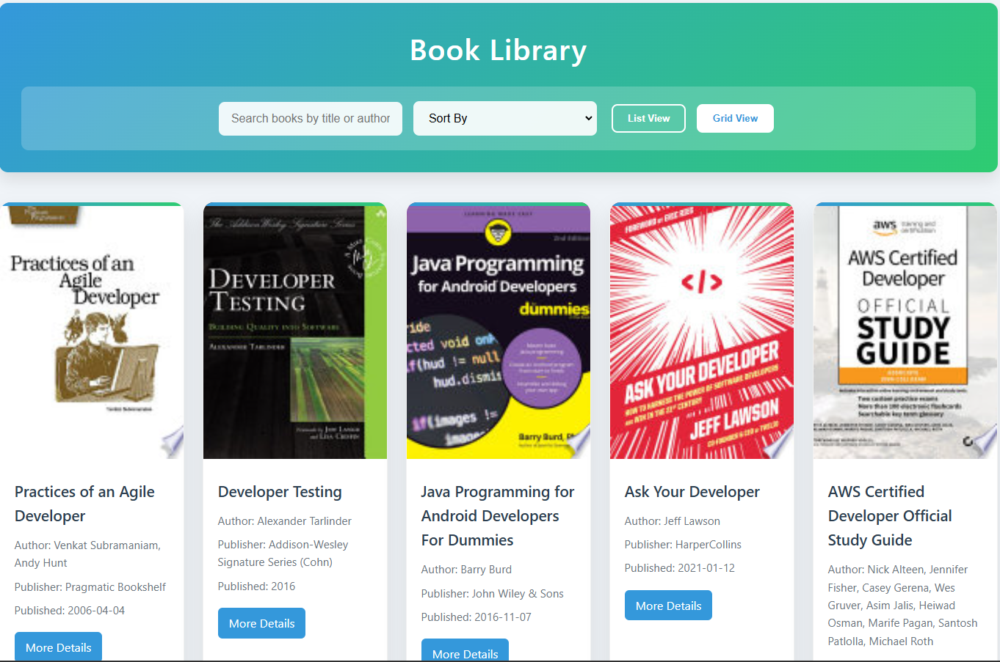
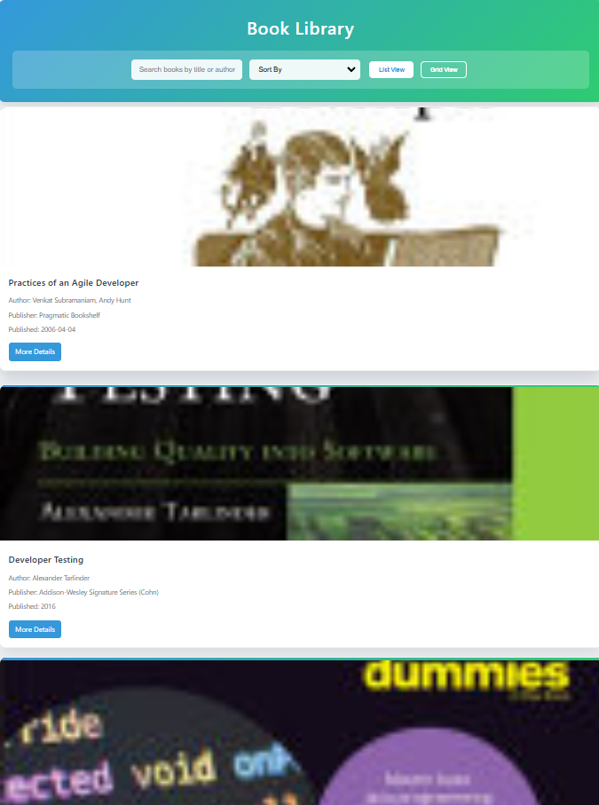

# Book Library

## Overview
The **Book Library** application allows users to search, sort, and browse books from a public API. It features a modern UI with both list and grid views, along with pagination controls for seamless navigation.

## Features
- **Search Books**: Users can search books by title or author.
- **Sort Functionality**: Books can be sorted by title (A-Z/Z-A) or by publication date (Oldest/Newest).
- **List & Grid View**: Toggle between list and grid views for better readability.
- **Pagination**: Navigate through multiple pages of books.
- **Book Details**: View essential book details like author, publisher, and publication date.
- **Responsive Design**: The UI is fully responsive and adapts to different screen sizes.

## Screenshots
### Home Page (Grid View)


### Home Page (List View)


## Technologies Used
- **HTML**: Structuring the web page.
- **CSS**: Styling with a modern, responsive layout.
- **JavaScript**: Fetching and dynamically rendering book data.
- **API**: Fetching books from [FreeAPI](https://api.freeapi.app/api/v1/public/books).

## How to Run the Project
1. Clone the repository:
   ```sh
   git clone https://github.com/yourusername/book-library.git
   ```
2. Navigate to the project folder:
   ```sh
   cd book-library
   ```
3. Open `index.html` in a web browser.

## Deployment
The project is live at:
[**Live Demo**](https://bookslibraryjs.netlify.app/)

---
**Author:** Nikhil Rathore  
**GitHub:** [Your GitHub Profile](https://github.com/blazeiscoding)

